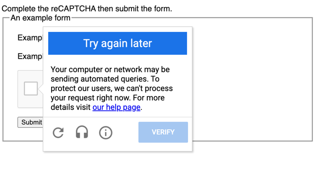

# Captcha Solver Product Directory

## Progress

- recaptcha_solverv2: executable (requires models folder: email contributers for access)
- browser automation: in testing


# Recaptchav2 Solver
### Discussion

This solver actually works reasonably well in the wild. This is due to [`recaptchv2`](https://recaptcha-demo.appspot.com/recaptcha-v2-checkbox-explicit.php) tests intput against some sort of similarity metric. So traditional testing metrics like Accuracy are not quite applicable, rather WER (word errror rate) or some more generic statistic like (letter error rate) is better.

### Features

- Takes Audio file as input
- Enhance audio file
- Generate transcription
- NOTE: any audio file is suitable that `ffmpeg` can convert to wav 
- simple extendable functional solution which can take more models (enhancers and trasncriptors)

### Installation

```
# Requirements (Versions below is environment tested on)
Python 3.10.6
ffmpeg

# Installation
# 1. Download solve_recaptchav2.py, models.zip, requirements.txt
# 2. Unpack models.zip # (email contributers)
# 3. Install dependencies
pip install -r /path/to/requirements.txt
# 4. Install ffmpeg
brew install ffmpeg # on mac with brew 
# 5. cd into model folder
# 6. Run
python3 solve_recpatchav2.py
# 7. Input relative path to .mp3 or .wav (so if there is a file one directory up then path would be ../MYAUDIOFILE.mp3)
# 8. Receive text transcription
```

### Running

```
# 1. run program
python3 solve_recaptchav2.py
# 2. provide relative path to audio file into user input (This is currently just for testing)
# 3. Hit enter
```
NOTE: path must be relative, this is due to the way `ffmpeg` interacts with python process, this will be solved in future updates.

### Outstanding work

- TODO Improve heuristic for solving word -> digit
- TODO Allow executable to take system wide path
- TODO Fine Tune models to improve performance on captcha datasets


# Browser interaction (incomplete)

## Installation

## MacOS 

### Requirements
```commandline
package manager
    brew
python
    selenium
```

```commandline
> brew install --cask chromedriver
> which chromedriver
> xattr -d com.apple.quarantine /opt/homebrew/bin/chromedriver
```

### Running demo
```commandline
> python3 browser-integration.py
```

## Functionality

`browser-integration` accesses a demo website provided by  [BotDetect](https://captcha.com/demos/features/captcha-demo.aspx).

### Features
    - Open Headless browser using python selenium
    - Navigate to Demo site
    - Find Captcha validation input
    - Request user input
    - Send response to captcha

### Outstanding work
    - TODO replace user input with classification result
    - TODO Download Audio file to process in real time
    - TODO Refactor to main entry point in `captcha-solver.py`
    - TODO Allow for multiple integrations with different captchas
        + DONE BotDetect
        + TODO [recaptcha](https://recaptcha-demo.appspot.com/recaptcha-v2-checkbox-explicit.php)
        + TODO [Telerik](https://demos.telerik.com/aspnet-ajax/captcha/examples/captchaaudiocode/defaultcs.aspx)

The Below table outlines which services are integrated for both Data and Captcha automation.

| Web       | Data | Integrated |
|-----------|------|------------|
| BotDetect | NO   | YES        |
| recaptcha | NO   | NO         |
| Telekrik  | YES  | NO         |

### Challenges
There are 2 major challenges
1. Audio Download from different sources in the web
2. Automating interaction with different Audio Captcha providers

#### Audio download
Audio for captcha are generally dynamically provided, hence the button and links to these files must
be located used different references for each type of captcha being worked on. Often times the links
to download this audio are incomplete, so it is not as simple as `wget [LINK_TO_AUDIO]`. This is a key
challenge as we cannot have a robust solver if we fail to collect the audio on a webpage. Retrieving this audio
requires a user to be using chrome and using `selenium` does not necessarily offer the solution.

#### Automating interaction with Selenium 
Each audio captcha provider uses its own standards for tagging and locating elements on a web page. There is no
one search that will find the correct element on a page to interact with. BotDetect for instance
can be navigated by looking for an html element where `name=captchaCode`. Google recaptcha is more complex since
a dialog box must be navigated to select audio and this is dynamically provided. Google also has robust methods
to limit automation so testing is a challenge without constantly changing IP address. See below:

