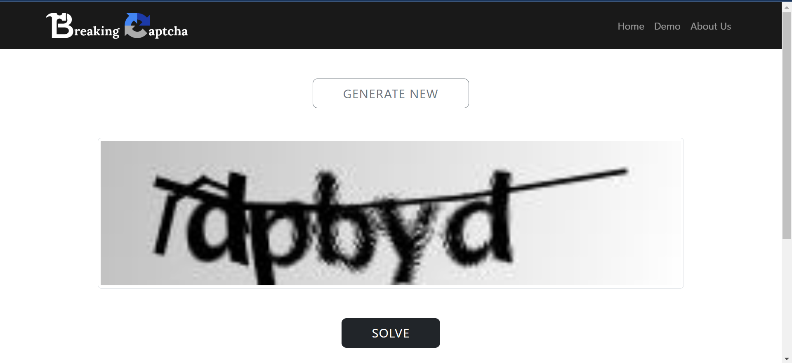

# Breaking Audio Captcha
This is the Project directory for Breaking Captcha Web-Dev project for Deakin Capstone.

Contributers:

- Agrim Gautam (s221071682@deakin.edu.au)
- ENOCK MOSIOMA NYAUNDI (enyaundi@deakin.edu.au)

## Summary

The aim of this stream is to make a website that will demonstarte the working of the project. This is a showcase website where our products can be described and promoted to consumers in an orderly, attractive and easily searchable manner.

## Website Development Overview

the below image shows the introduction page of the breaking captcha project website.

the below image shows the Demo page of the breaking captcha project website where the user can choose a captcha to solve.

## Data Sources

## AI/ML Approach

## Resources

## References

## Usage and Guides

### File structure
#### resources
This folder contains all the resources used in the project. This includes the html files, images and css, js files.
#### index.html
This is the main html file which contains the main code for the website.
